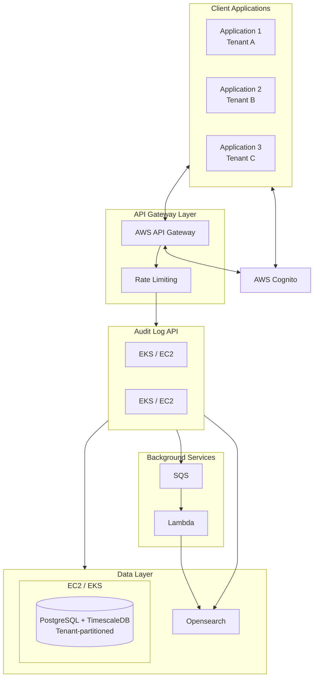
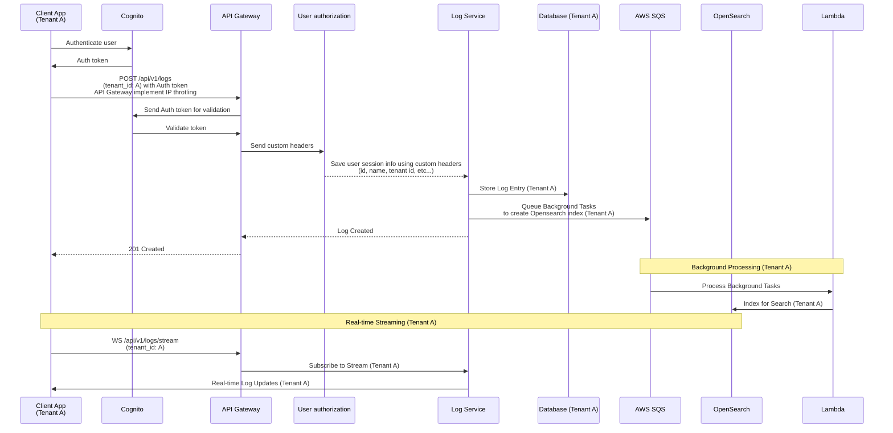

# Audit Log API

A comprehensive audit logging API system that tracks and manages user actions across different applications.

## Setup
### Using Docker (Recommended)

1. Build and start all services:

```bash
docker-compose up --build
```

The application will be available at http://localhost:8000. All services (PostgreSQL, OpenSearch, and SQS, Lambda) will
be automatically configured and started.

### Local Development

#### 1. Create a virtual environment:

```bash

python -m venv venv
source venv/bin/activate  # On Windows: venv\Scripts\activate
```

#### 2. Install dependencies:

**2.1. Python dependencies**

```bash

pip install -r requirements.txt
```

**2.2. Local stack**

Choose an installation method [here](https://docs.localstack.cloud/aws/getting-started/installation/) and follow

**2.3. Opensearch**

Choose an installation
method [here](https://docs.opensearch.org/docs/latest/install-and-configure/install-opensearch/index/) and follow

**2.4. Postgresql**

- Choose an installation method [here](https://www.postgresql.org/docs/current/installation.html) and follow
- Create the corresponding database and user and use the credential to update `.env` file

#### 3. Set up environment variables:

Create a `.env` file using `.env.example` file and populate its data

```bash

cp .env.example .env
```

#### 4. Run the Lambda init script

```bash

python lambda/deploy
```

#### 5. Start the application:

```bash

uvicorn app.main:app --reload
```

## API Documentation

The API is documented using OpenAPI and can be accessed at:

- Swagger UI: http://localhost:8000/docs
- ReDoc: http://localhost:8000/redoc

## Features

### ✅ Have

- Asynchronous session pool will help deal with request spike
- Most of the core audit log, tenants creation and retrieval API endpoints
- Database setup
- Basic search and filtering functionality
- Database schema design and implementation with multi-tenant support
- Authentication and authorization system with tenant isolation
- Basic security controls and data validation
    - Using custom headers received from API gateway to authorization (authentication will happen in API Gateway)
- AWS SQS setup for background processing
    - Using LocalStack to mimic AWS in local environment
- OpenSearch setup for search capabilities
- Multi-tenant implementation and tenant management
- Advanced search with full-text capabilities using OpenSearch
- Real-time log streaming via WebSocket
- Data retention using timescaleDB's existed feature
  - Setups for timescale is in `timescale_init.py` file
- Performance optimization and database-specific tuning
    - Set `tenant_id` as a clustering dimension in timescale DB
- SQS worker implementation for background tasks
- Export functionality (JSON, CSV)

### ❌  Don't have

- All the services are just locally setup, not connecting to AWS yet
- Bulk log create feature
- Data archival
    - Need to upload data to cold storage in S3?
- Testing
- API Gateway setup
    - No API throttling, caching and custom headers yet

## Others

-  `/api/v1/logs/board` endpoint provides a board to watch log streaming
- Since API Gateway is not yet setup, there is a middleware (`dev_auth.py`) that put required custom header for each request to help caller authorize as admin
- TimescaleDB is not compatible with RDS Postgresql, so using this design has a big caveat of having to manually scale, monitoring, update,... DB instance

## System graph



### Flow


